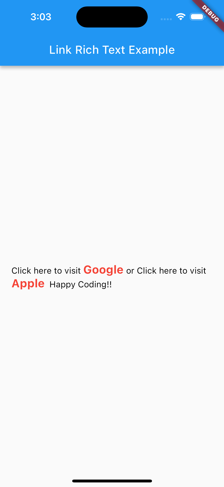

# HyperLink

HyperLink is a Flutter package for rendering text with clickable hyperlinks.



## Features

- **Clickable Hyperlinks**: Automatically detects and renders clickable hyperlinks in text.
- **Custom Styling**: Customize the style of hyperlinks and non-link text independently.
- **URL Launching**: Handles launching URLs in the default browser when hyperlinks are tapped.
- **Configurable**: Adjust text alignment, text direction, max lines, and more.

## Installation

Add the following to your `pubspec.yaml` file:

```yaml
dependencies:
  hyperlink: ^0.0.4
```

Then, run:

```bash
$ flutter pub get
```

## Usage

Import the package in your Dart code:

```dart
import 'package:hyperlink/hyperlink.dart';
```

Use the `HyperLink` widget to render text with clickable hyperlinks:

```dart

HyperLink
(
textStyle: TextStyle(color: Colors.black, fontSize: 15),
linkStyle: TextStyle(
color: Colors.red, fontWeight: FontWeight.w700, fontSize: 20),
text:
'Click here to visit [Google](https://www.google.com) or Click here to visit [Apple](https://www.apple.com)\t Happy Coding!!',
linkCallBack: (link) {
//the clicked link
},
)
```

## Parameters

- **text**: The text to display, including hyperlinks.
- **linkStyle**: The style of the hyperlink text.
- **textStyle**: The style of the non-link text.
- **mode**: The launch mode for opening URLs.
- **webViewConfiguration**: The configuration for web view.
- **webOnlyWindowName**: The name of the web-only window.
- **textAlign**: The text alignment.
- **textDirection**: The text direction.
- **softWrap**: Whether the text should break at soft line breaks.
- **overflow**: How visual overflow should be handled.
- **textScaleFactor**: The scaling factor for the text.
- **maxLines**: The maximum number of lines for the text to span.
- **locale**: The locale for this text.
- **strutStyle**: The strut style to use.
- **textWidthBasis**: The width basis for the text layout.
- **textHeightBehavior**: The height behavior to use.
- **selectionRegistrar**: The registrar for text selection.
- **selectionColor**: The color to use when highlighting the text for selection.

## Examples

For examples and additional usage scenarios, see
the [example](https://github.com/Odinachi/hyperlink/tree/master/example) directory.

